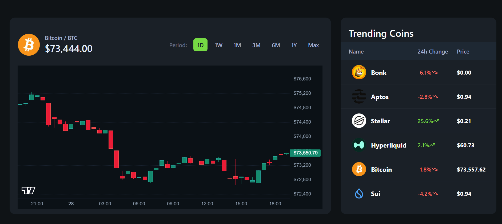

# 📈 CryptoPulse — Real-Time Crypto Analytics Platform

<div align="center">




### 🚀 High-Performance Real-Time Cryptocurrency Analytics Dashboard

Built with modern web technologies for speed, precision, and real-time market intelligence.

</div>

---

# 📖 Overview

CryptoPulse is a modern cryptocurrency analytics platform built using:

- Next.js 16  
- TailwindCSS v4  
- shadcn/ui  
- CoinGecko API  
- WebSocket real-time streams  

The platform delivers:

⚡ Real-time crypto price tracking  
📊 Interactive TradingView charts  
📡 Live orderbook updates  
💱 Multi-fiat conversion tools  
🔍 Advanced token search & analytics  

CryptoPulse is designed for users who want a fast, responsive, and visually powerful cryptocurrency dashboard experience.

---

# ✨ Features

# 📡 Real-Time Market Data

Powered by the API from:

👉 https://www.coingecko.com/

The platform fetches cryptocurrency market data and enhances it using WebSocket-based live updates for ultra-fast real-time experiences.

---

## ⚡ Live Price Tracking

- High-frequency crypto price updates  
- Low-latency market data  
- Real-time price synchronization  
- Smooth live market interactions  

---

## 📚 Live Orderbook Streams

- Real-time orderbook visualization  
- Streaming market depth updates  
- Fast WebSocket event handling  
- Optimized rendering performance  

---

## 📊 TradingView Charts

Interactive candlestick charts powered by TradingView.

Includes:

- OHLCV visualization  
- Candlestick charts  
- Real-time chart updates  
- Zoom & timeframe controls  
- Precision market analysis  

---

## 🌍 Dynamic Homepage

The homepage provides:

- Global crypto statistics  
- Trending cryptocurrencies  
- Market overview  
- Top gainers & losers  
- Live market movement  

---

## 🔍 Advanced Token Pages

Each token page includes:

- Live pricing  
- Market statistics  
- TradingView charts  
- Multi-fiat converter  
- Real-time analytics  
- Searchable datasets  

---

# 🛠️ Tech Stack

## ⚡ Frontend

- Next.js 16  
- React  
- TypeScript  
- TailwindCSS v4  
- shadcn/ui  

---

## 📡 Real-Time Infrastructure

- WebSockets  
- CoinGecko API  
- Live streaming updates  
- High-frequency event handling  

---

## 📊 Data Visualization

- TradingView Charts  
- Real-time candlestick rendering  
- Interactive market analytics  

---

# 🚀 Why WebSockets?

Instead of relying only on normal API polling, this project uses WebSockets to achieve:

✅ Faster updates  
✅ Lower latency  
✅ Real-time synchronization  
✅ Better trading experience  
✅ More responsive UI  

This creates a smoother and more professional crypto analytics platform.


# 🚀 Getting Started

## 1️⃣ Clone the repository

```bash
git clone https://github.com/yourusername/cryptopulse.git
```

---

## 2️⃣ Install dependencies

```bash
npm install
```

---

## 3️⃣ Add environment variables

```env
COINGECKO_BASE_URL=
COINGECKO_API_KEY=

NEXT_PUBLIC_COINGECKO_WEBSOCKET_URL=
NEXT_PUBLIC_BINANCE_WEBSOCKET_URL=
NEXT_PUBLIC_COINGECKO_API_KEY=


```

---

## 4️⃣ Start development server

```bash
npm run dev
```

---

# 🔄 Application Flow

```text
CoinGecko API
        ↓
Fetch market data
        ↓
WebSocket live streams
        ↓
Real-time updates
        ↓
TradingView visualization
        ↓
Interactive analytics dashboard
```

---

# 🎨 UI/UX Philosophy

CryptoPulse focuses on:

- Speed  
- Precision  
- Clarity  
- Modern UI  
- Smooth interactions  
- Data readability  

Every component is designed for a clean and professional trading experience.

---

# 🌟 Key Highlights

✅ Real-time crypto analytics  
✅ WebSocket-powered updates  
✅ TradingView integration  
✅ Interactive candlestick charts  
✅ Multi-fiat converter  
✅ Advanced token search  
✅ High-performance rendering  
✅ Modern dashboard UI  

---

# 💡 What This Project Demonstrates

This project showcases experience with:

- Real-time systems  
- WebSocket architecture  
- Financial dashboards  
- API integrations  
- Data visualization  
- Modern frontend engineering  
- High-performance UI development  

---

# 🚀 Future Improvements

- Portfolio tracking  
- Watchlists  
- Authentication system  
- News aggregation  
- AI-powered market insights  
- Technical indicators  
- Historical portfolio analytics  
- Push notifications  

---

# ❤️ Final Note

CryptoPulse is more than just a crypto dashboard.

It is a modern real-time analytics platform designed to deliver fast, interactive, and professional cryptocurrency market experiences using modern frontend technologies and WebSocket infrastructure.

---

<div align="center">

## 📈 Built for Real-Time Market Intelligence

Powered by Next.js, WebSockets & CoinGecko 🚀

</div>